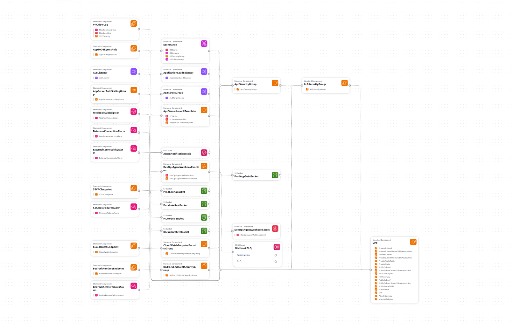

# Automated Network Incident Response with AWS DevOps Agent

A hands-on demo and walkthrough of automated network incident response using **AWS DevOps Agent**, tested against a real AWS workload.

This project follows the official AWS blog post:
> [Automated network incident response with AWS DevOps Agent](https://aws.amazon.com/blogs/networking-and-content-delivery/automated-network-incident-response-with-aws-devops-agent/) — AWS Networking & Content Delivery Blog

---

## 📺 Watch the Recording

See this in action — I walk through the full setup, configuration, and a live incident response demo tested on my own AWS workload.

🎬 **[Watch the Demo Recording](https://drive.google.com/file/d/1xtiifxA1N-xe2k5qU28OwiE3UxiS5qJt/view)**

---

## 🚀 Get Started with the Template

Want to try this yourself? Use the template to deploy the setup in your own AWS account.

📦 **[View / Download Template](#)** ← https://github.com/aws-samples/sample-automated-aws-devops-agent-network-incident-response

---

## What This Demo Covers

- Setting up **AWS DevOps Agent** for network incident response
- Connecting **CloudWatch alarms** to trigger the agent via webhook
- Watching the agent automatically correlate metrics, logs, VPC Flow Logs, and API change history
- Getting a root cause analysis and mitigation plan — without manual investigation
- Testing the full flow end-to-end on a real AWS workload

---

## Architecture

---

## How It Works

When a network incident occurs:

1. A **CloudWatch alarm** fires and sends an alert to AWS DevOps Agent via webhook
2. The agent correlates data across metrics, logs, VPC Flow Logs, and CloudTrail API history
3. It identifies the root cause and surfaces a recommended mitigation plan
4. Engineers get a clear picture of what happened — without spending hours digging through logs

This dramatically reduces Mean Time to Resolution (MTTR) for network-related incidents.

---

## References

- 📖 [Official AWS Blog — Automated network incident response with AWS DevOps Agent](https://aws.amazon.com/blogs/networking-and-content-delivery/automated-network-incident-response-with-aws-devops-agent/)
- 📖 [AWS DevOps Agent overview](https://aws.amazon.com/blogs/aws/aws-devops-agent-helps-you-accelerate-incident-response-and-improve-system-reliability-preview/)
- 📖 [How AWS DevOps Agent uses multi-agent reasoning to find root causes](https://aws.amazon.com/blogs/devops/how-aws-devops-agent-uses-multi-agent-reasoning-to-find-root-causes/)

---

